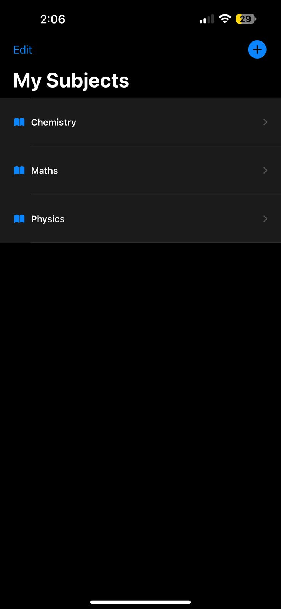
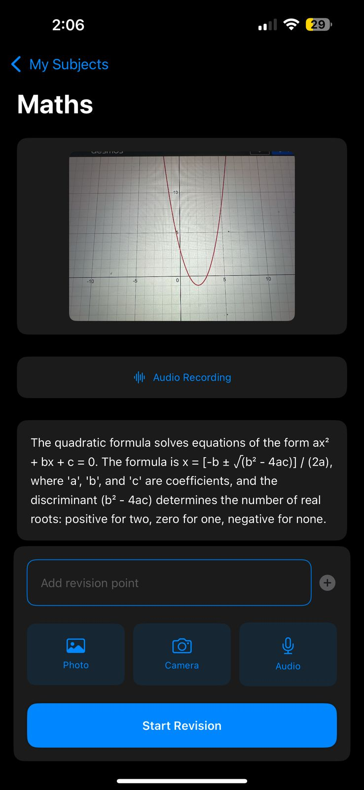
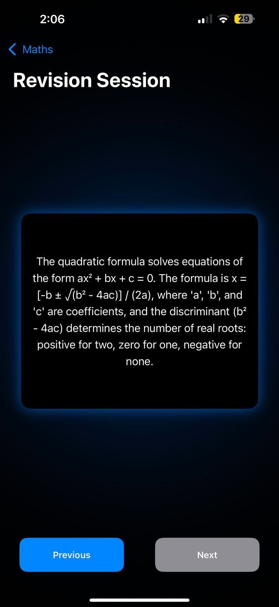

# Cramly – Swift Student Challenge  

Cramly is your last-minute revision companion! Capture, type, or record study material and convert them into flashcards for a quick and efficient revision. Designed specifically for students preparing for exams, Cramly helps retain key information effortlessly.  

## ✨ Features  

- **Text Flashcards** – Quickly type and save important points.  
- **Image Flashcards** – Capture notes or diagrams and store them as revision cards.  
- **Audio Flashcards** – Record key concepts and play them back anytime.  
- **Image to Text (OCR)** – Convert handwritten or printed notes into editable text flashcards.  
- **Audio to Text (Speech-to-Text)** – Automatically transcribe spoken words into text-based flashcards.  
- **Dark Mode Support** – Study without straining your eyes.  
- **Smooth Swipe Navigation** – Effortlessly browse through your revision cards.  

## 📸 Screenshots  

| Add Subjects | Create Revision Notes | Swipe to Revise |  
|--------------|----------------|-----------------------|  
|  |  |  |  

---

This project is built for the **Swift Student Challenge** and focuses on enhancing the study experience through a seamless and efficient flashcard-based revision system. 🚀  
